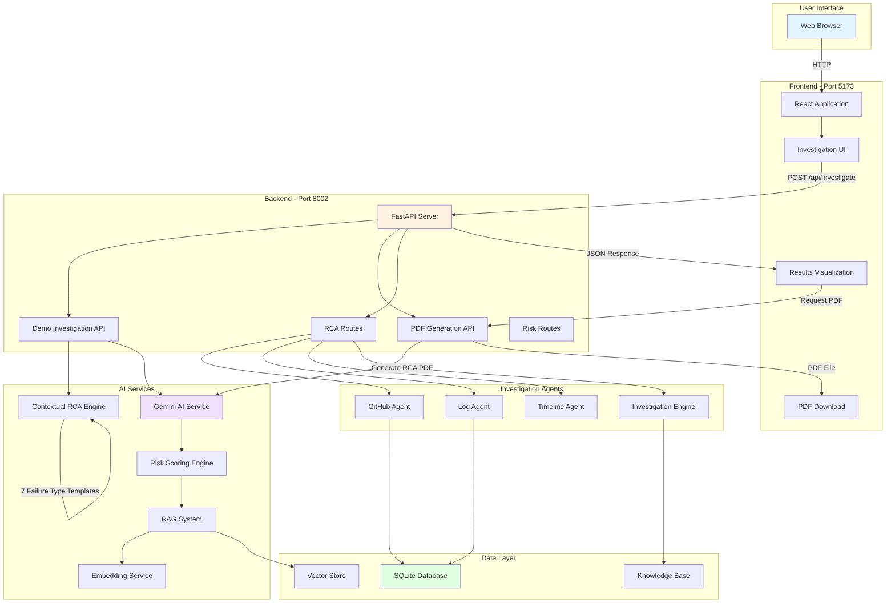

# SmartOps AI - Agentic Incident Intelligence Platform

An intelligent incident investigation platform that automates root cause analysis by correlating runtime logs, GitHub commits, and historical incidents using AI-powered agents.

## Key Features

- **Automated Investigation**: Reduces incident analysis time from 2-4 hours to 30 seconds
- **Multi-Agent System**: GitHub Agent, Log Agent, Investigation Engine, RAG System, and Gemini AI
- **7 Failure Types**: Database timeout, Memory leak, CPU spike, API rate limit, Cache storm, Network partition, Disk I/O
- **Contextual Analysis**: Adapts investigation approach based on failure type
- **Historical Learning**: RAG-based similarity search across past incidents
- **Comprehensive Reports**: Timeline, root cause, impact analysis, and prioritized recommendations
- **PDF Export**: Generate professional RCA reports

## Technology Stack

### Frontend
- React 18 + Tailwind CSS
- Vite (Build tool)
- Axios (HTTP client)
- React Router v6

### Backend
- FastAPI (Python 3.11+)
- Google Gemini Pro (AI)
- SQLite (Database)
- SQLAlchemy (ORM)
- Sentence Transformers (Embeddings)
- ReportLab (PDF generation)

## Project Structure

```
Incident_Intelligent_Platform/
├── Project/
│   ├── backend/              # FastAPI backend
│   │   ├── ai/              # AI services (Gemini, RAG, embeddings)
│   │   ├── api/             # API routes
│   │   ├── database/        # Database models
│   │   ├── schemas/         # Pydantic schemas
│   │   ├── main.py          # FastAPI application
│   │   ├── run_server.py    # Server startup
│   │   └── requirements.txt # Python dependencies
│   │
│   ├── frontend/            # React frontend
│   │   ├── src/
│   │   │   ├── components/  # React components
│   │   │   ├── pages/       # Page components
│   │   │   ├── services/    # API services
│   │   │   └── context/     # State management
│   │   ├── package.json     # Node dependencies
│   │   └── vite.config.js   # Vite configuration
│   │
│   └── agents/              # Investigation agents
│       ├── github_agent.py
│       ├── log_agent.py
│       ├── investigation_engine.py
│       └── timeline_agent.py
│
└── README.md                # This file
```

## Quick Start

### Prerequisites
- Python 3.11 or higher
- Node.js 18 or higher
- Git

### Backend Setup

1. Navigate to backend directory:
```bash
cd Project/backend
```

2. Create and activate virtual environment:
```bash
python -m venv venv
source venv/bin/activate  # Windows: venv\Scripts\activate
```

3. Install dependencies:
```bash
pip install -r requirements.txt
```

4. Configure environment:
```bash
cp .env.example .env
# Edit .env and add your GEMINI_API_KEY
```

5. Start backend server:
```bash
python run_server.py
```

Backend will be available at: http://localhost:8002

### Frontend Setup

1. Navigate to frontend directory:
```bash
cd Project/frontend
```

2. Install dependencies:
```bash
npm install
```

3. Start development server:
```bash
npm run dev
```

Frontend will be available at: http://localhost:5173

### Demo Application

The chaos demo platform can run on http://localhost:5175

Clone and setup:
```bash
git clone https://github.com/Vaish5002/chaos-demo-platform.git
cd chaos-demo-platform
npm install
npm run dev
```

**Note:** For demo mode, the demo platform is optional. The backend uses contextual RCA generation based on incident descriptions, allowing standalone operation without external dependencies.

## Usage

### Running an Investigation

1. Access SmartOps AI at http://localhost:5173
2. Login with credentials:
   - Email: operator@smartops.ai
   - Password: password123
3. Navigate to "Investigation"
4. Enter incident details:
   - GitHub URL: https://github.com/Vaish5002/chaos-demo-platform
   - Description: e.g., "Database timeout after deployment"
5. Click "Investigate"
6. Review automated analysis:
   - Timeline of events
   - Root cause identification
   - Impact assessment
   - Prioritized recommendations
   - Similar historical incidents
7. Download PDF report

### Incident Description Examples

The AI analyzes your description and adapts its investigation. The contextual RCA engine uses keyword detection to identify failure types:

### Supported Failure Types

1. **Database Issues**: "Database timeout in chaos platform after deployment"
   - Keywords: database, db, connection, pool, timeout, sql
   - Risk Score: 92 | Severity: CRITICAL

2. **Memory Problems**: "Application memory usage growing continuously leading to OOM errors"
   - Keywords: memory, leak, heap, oom, outofmemory
   - Risk Score: 88 | Severity: HIGH

3. **Performance**: "Sudden CPU utilization spike to 100% causing request timeouts"
   - Keywords: cpu, compute, processor, spike, 100%
   - Risk Score: 90 | Severity: CRITICAL

4. **API Issues**: "External API returning 429 errors - rate limit exceeded"
   - Keywords: api, rate limit, 429, throttle, quota
   - Risk Score: 82 | Severity: HIGH

5. **Cache Problems**: "Cache invalidation causing database overload and cascading failures"
   - Keywords: cache, redis, miss, storm, invalidation
   - Risk Score: 89 | Severity: CRITICAL

6. **Network Issues**: "Service-to-service communication failures due to network connectivity"
   - Keywords: network, partition, connectivity, service-to-service
   - Risk Score: 95 | Severity: CRITICAL

7. **Storage Issues**: "Disk I/O saturation causing slow database queries and timeouts"
   - Keywords: disk, i/o, io, storage, iops
   - Risk Score: 86 | Severity: HIGH

Each failure type generates contextually appropriate:
- Timeline of events (deployment → errors → impact)
- Specific log patterns for that failure type
- Root cause with commit details and file changes
- Targeted recommendations (IMMEDIATE → LONG-TERM)
- Similar historical incidents with resolution outcomes

## Architecture



### System Flow

1. **User Request**: User submits incident description via frontend
2. **Keyword Detection**: Backend analyzes description to identify failure type
3. **Contextual RCA**: System generates appropriate RCA based on detected type
4. **AI Enhancement**: Gemini AI enriches analysis with insights
5. **Results**: Complete investigation report with timeline, root cause, and recommendations
6. **PDF Export**: Professional report available for download

### Multi-Agent System

1. **GitHub Agent**: Fetches commits, analyzes code changes, identifies risky modifications
2. **Log Agent**: Processes runtime logs, extracts error patterns, identifies failure signatures
3. **Investigation Engine**: Correlates events, matches timestamps, calculates risk scores
4. **RAG System**: Searches similar historical incidents using semantic similarity
5. **Gemini AI**: Synthesizes findings, generates RCA reports, provides recommendations
6. **Contextual RCA Engine**: Keyword-based detection system that adapts analysis to failure type

## API Endpoints

### Investigation
- `POST /api/investigate` - Start new investigation
- `GET /api/investigations/{id}` - Get investigation results

### RCA Generation
- `POST /api/generate-rca` - Generate RCA report
- `POST /api/quick-rca` - Quick analysis

### PDF Export
- `GET /api/pdf/generate-from-incident/{id}` - Download PDF report

### Health Checks
- `GET /health` - Backend health
- `GET /api/pdf/health` - PDF service health

Full API documentation available at: http://localhost:8002/docs

## Configuration

### Backend Environment Variables (.env)
```
GEMINI_API_KEY=your_api_key_here
API_HOST=0.0.0.0
API_PORT=8002
DEBUG=True
DATABASE_URL=sqlite:///./smartops_ai.db
```

### Frontend Configuration
- Default API URL: http://localhost:8002
- Can be configured in `src/services/api.js`

## Development

### Running Tests

Backend:
```bash
cd Project/backend
pytest
```

Frontend:
```bash
cd Project/frontend
npm test
```

### Code Style
- Backend: Follow PEP 8, use type hints
- Frontend: Use ESLint configuration, functional components with hooks

## Deployment

### Development
```bash
# Terminal 1: Backend
cd Project/backend && python run_server.py

# Terminal 2: Frontend
cd Project/frontend && npm run dev
```

### Production
Backend:
```bash
cd Project/backend
gunicorn main:app --workers 4 --bind 0.0.0.0:8002
```

Frontend:
```bash
cd Project/frontend
npm run build
# Serve dist/ folder with nginx or static hosting
```

## Team Contributions

### Member 1: Investigation Engine & GitHub Integration
- GitHub Agent implementation
- Log Agent implementation
- Investigation Engine orchestration
- Timeline API development

### Member 2: Chaos Demo Platform
- 7 failure type simulations
- Runtime log generation
- Failure injection APIs
- Deployment infrastructure

### Member 3: AI & RCA Engine
- Google Gemini integration
- RAG system implementation
- RCA generation logic
- Risk scoring engine
- Embedding service
- PDF report generation

### Member 4: Frontend & Dashboard
- React application development
- Investigation UI
- Results visualization
- Timeline display
- Analytics dashboard

## Troubleshooting

### Backend Issues
- **Port 8002 in use:** Kill the process or change port in .env
- **Missing GEMINI_API_KEY:** Add to Project/backend/.env
- **Module errors:** Activate virtual environment

### Frontend Issues
- **Port 5176 in use:** Change port in vite.config.js
- **Build errors:** Delete node_modules and reinstall: `npm install`
- **API errors:** Verify backend is running on port 8002

### Demo App Issues
- **Port 5175 in use:** Change port in demo app configuration
- **Failures not working:** Refresh page and retry

## License

MIT License

## Repository Links

- Main Project: https://github.com/Vaish5002/Incident_Intelligent_Platform
- Demo Platform: https://github.com/Vaish5002/chaos-demo-platform

## Contact

For questions or support, please open an issue on GitHub.
